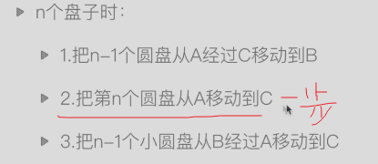
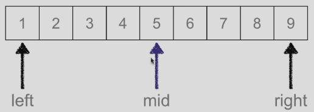
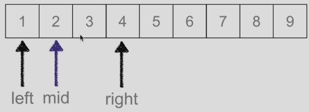
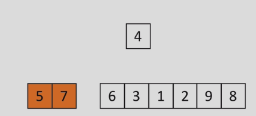
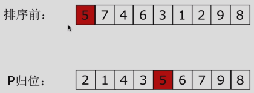
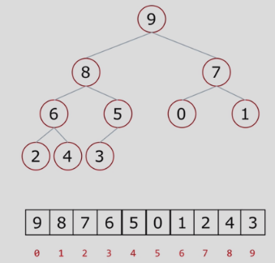

layout: post
title: "算法"
date: 2021-06-17
description: "算法的一些介绍"

tag: 算法
---   

> 用来解决一类问题的方法；可以通过时间复杂度和空间复杂度来评估

---

## 评估方法

1. 时间复杂度

   即程序运行需要消耗的时间。因为不同机器、不同输入消耗的时间都不同，所以评价时间复杂度的指标，一般用笼统的方式O(1)、O(n)等表示的单位来评估。他们的单位大小为：

   O(1)<O(logn)<O(n)<O(n*logn)<O(n^2); 

   注意：这里不同O(1)等只是单位，不具有数量关系，即表示该代码运行的时间是这个数量级。比如多条简单的代码，一个代码的时间复杂度时O(1),但是几条放在一起运行时间复杂度还是O(1)。

   这里一条简单的命令如打印print，复杂度为1,而查找、排序等的复杂度比较高

   循环n次的复杂度为O(n)，如果可以循环减半的话，则复杂度是O(logn)，如果两重循环是O(n^2)

2. 空间复杂度

   即程序运行需要消耗内存资源的多少。一般在平衡时间和空间复杂度时，采用空间换时间的方式。

---

## 递归

> 调用自己，且有终止条件


1. 汉诺塔问题

   **问题：**有三个柱子，其中最左边的柱子上套了n个圆环，其中圆环的大小从下往上依次变小，现在要把所有圆环移动到最右边的柱子上，并且要求，每次只能移动一个圆环，并且始终保持大的圆环在下，小的在上。

   **实例推演：**柱子从左到右分别命名为ABC，圆环从上到下按照0 ~ (n-1)命名。若n=1，直接把圆环移动到C；若n=2，先把第0个圆环移动到B，再把最后一个圆环移动到C，最后把第0个圆环移动到C；若n=3，先把第0个圆环移动到C，把第1个圆环移动到B，再把第0个圆环移动到B，然后把最后一个圆环移动到C，把第0个圆环移动到A，第一个圆环移动到C，最后把第0个圆环移动到C；

   **思路：**把0~(n-2)个圆环看成一个整体，把最下面的第n-1个圆环看成一个。然后首先先把0~(n-2)个圆环经过C移动到B，再把最后一个圆环从A移动到C，最后再把0~(n-2)个圆环至A移动到C。只有第二步是一步问题，但是1和3是比原问题规模小了一个同样的问题

   

   ```python
   n = 3
   # fromSite A起始位置 throughSite B经过位置 toSite C最终位置
   # 终止条件为n=0时，没有盘子时不移动
   def hanoi(n, from_site, through_site, to_site):
       if n>0:
           hanoi(n-1, from_site, to_site, through_site)
           print(" {site}'disk: move from {from_site} to {to_site}".format(site = str(n), from_site = from_site, to_site = to_site))
           hanoi(n-1, through_site, from_site, to_site)
   hanoi(3, 'A', 'B', 'C')
   ```

   递推公式：
   $$
   h(x)=2h(x-1)+1
   $$

---

## 查找问题

### 顺序查找

> 从头按顺序依次查找，直到匹配最后一个列表元素，如果查到元素，返回元素下标，未查到返回-1或None

```python
def linearSearch(li, val):
    for index, item in enumerate(li):
        if item == val:
            return index
    else:
        return -1
li = range(10)
linearSearch(li,11)    
```

时间复杂度为O(n)

### 二分查找

> 先**排序**，然后和中间值（一半）比较，根据比较的大小，再确定下次查找所需的一半空间的范围

```python
def binarySearch(li, val):
    left = 0
    right = len(li)-1
    while left <= right: # 候选区有值
        mid = (left+right+1)//2
        if li[mid] == val:
            return mid
        elif li[mid] < val: # 待查找的值在mid右侧
            left = mid+1
        else:
            right = mid-1
    else:  # left <= right 条件不满足
        return None
```





时间复杂度O(logn)

---

## 排序

---

> 将**无序**的记录序列调整为**有序**的记录序列
>
> LowB三人组：冒泡排序、选择排序、插入排序
>
> 排序NB三人组：快速排序、堆排序、归并排序
>
> 其他排序：希尔排序、计数排序、基数排序

### 冒泡排序

> 从头开始依次遍历直到n-1,比较相邻的两个元素值得大小，如果第一个元素大于（顺序）或小于（逆序）第二个元素，则调换两个元素的位置；一轮结束后，则**无序区**减少一个数，**有序区**增加一个数

```python
# 原地排序
def bubbleSort(li, decrease = True):
    for i in range(len(li)-1):  # 第i趟
        exchange = False
        for j in range(len(li)-1-i): # 无序区指针位置
            if decrease:
                # decreasing order
                if li[j] < li[j+1]:
                    li[j], li[j+1] = li[j+1], li[j]
                    exchange = True
            else:
                if li[j] > li[j+1]:
                    li[j], li[j+1] = li[j+1], li[j]
                    exchange = True
        # 如果一趟循环没有发生交换，则说明已经排好序
        if exchange == False:
            return li
    return li
bubbleSort(li, decrease = True)    
```

复杂度是O(n^2)

### 选择排序

> 从无序区遍历选择一个最小或者最大的值放在一个新的列表，或者将最小值或最大值依次和第i个值做置换，不使用新的列表可以节约内存资源。

```python
# 尽量直接在原始数据上进行操作，尽量不要拷贝变量，或新建变量，如果数据大会增加内存负担
def selectSortSimple(li):
    new_list = []
    for i in range(len(li)):
        min_val = min(li)
        new_list.append(min_val)
        # remove一次仅删除一个值
        li.remove(min_val)
    return new_list
# n-1轮循环，每轮循环从无序区选择一个最小数和无序区第一个数交换，所以需要记录无序区最小值的位置
def selectSortSimple(li):
    for i in range(len(li)-1): # 第i趟
        min_loc = i
        for j in range(i+1, len(li)): 
            if li[j] < li[min_loc]:
                min_loc = j
        print(min_loc)
        li[i], li[min_loc] = li[min_loc], li[i]
    return li
# 复杂度是O(n^2),remove和min都是O(n)的操作
```

### 插入排序

> 遍历从1(第二个元素开始)，依次从**无序区**取一个数，然后与**有序区**的值进行比较，找到它应该放置的位置。列表的第一个元素不用排序，作为**有序区**第一个元素，类似于摸牌时新摸到一张牌按大小放的位置

```python
# 先取无序区第一个数，然后依次与有序区的数比较，从右向左比较，因为只有最右边有空间可以移动
def selectOrder(li):
    for i in range(len(li)-1): # i,表示手里有序牌最右侧的下标
        insert_loc = i+1 # 摸到牌的下标
        for j in range(i+1):
            if li[i-j] > li[insert_loc]:
                li[i-j], li[insert_loc] = li[insert_loc], li[i-j]
                insert_loc = i-j
            else:
                next
    return li
```



### 快速排序

> 1. 取一个元素p（第一个元素），使元素p归位；
> 2. 列表被p分为两个部分，左边都比p小，右边都比p大
> 3. 递归完成排序



```python
from cal_time import *
# 代码很对称，tmp取出值，最后再把值放回去
def partition(li, left, right):
    tmp = li[left]
    while left < right:
        # 从右面找比tmp小的数，如果left = right，退出
        while left < right and li[right] >= tmp:
            right -= 1             # 往左边一步
        # 把右边找到的数写给左边空位上
        li[left] = li[right]
        # <=需要改成<,这样可以将等于的情况也移动到左边大的区域进行进一步排序
        while left < right and li[left] < tmp:
            left += 1
        # 把左边找到的数写给右边空位上
        li[right] = li[left]
    # 把tmp归位
    li[left] = tmp
    return li, left
def _quickSort(li, left, right):
    if left < right: #至少两个元素
        # 列表没有切片，因为切片也需要花费时间
        li, mid_site = partition(li, left, right)
        _quickSort(li, left, mid_site-1)
        _quickSort(li, mid_site+1, right)
    return li
# 加一个马甲包装
@cal_time
def quickSort(li):
    _quickSort(li, 0, len(li)-1)
# li = [6, 1, 3, 2, 6, 9, 2, 8, 6, 4, 7]
# print(li)
# partition(li, 0, len(li)-1)
# print(li)
# quickSort(li, 0, len(li)-1)
# print(li)
```

**时间复杂度**：O(nlogn)

**局限性**：

1. 最坏情况，[9,8,6,5,4,3,2,1]这种情况时间复杂度是O(n^2)，每次只能拍一个数
2. 递归的最大限制，可以修改

### 堆排序

> 你

**基础知识**：

1. 树是一种数据结构，比如系统的目录结构
2. 树是一种可以递归定义的数据结构
3. 树是由n个节点组成的集合
   - 如果n=0，则是一棵空树
   - 如果n>0，那存在一个节点作为树的根节点，其他节点可以分为m个集合，每个集合本身又是一棵树
4. 根节点（源节点）、叶子节点（不能再分割的节点）
5. 树的高度（深度），最深有几层，相当于网络的最大直径
6. 树的度（网络中最大度是树的度），节点的度（下游分叉的个数，即网络中节点的degree-1，）
7. 子节点（下一级）、父节点（上一级）
8. 子树，大树中的树杈

**二叉树**：

- **概念**：

  - 度不超过2的数，即每棵树的分叉只有2，每个节点最多有两个孩子节点

  - 两个孩子节点被区分为左孩子节点和右孩子节点
  - **满二叉树**：一个二叉树，**每一层**的节点数都达到了最大值
  - **完全二叉树**：叶节点只能出现在最下层和次下层，并且最下面一层的节点都集中在该层**最左边**的**若干位置**的二叉树；相当于从满二叉树右边拿走几个节点

- **二叉树存储方式**（表示方式）：

  - 链式存储

  - 顺序存储---列表存

    - 父节点与左孩子节点编号下标关系：i -> 2i+1, i是父节点编号
    - 父节点与右孩子节点编号下标关系：i -> 2i+2, i是父节点编号

    

**堆**：

> 一种特殊的完全二叉树结构

- 大根堆：一颗完全二叉树，满足任一节点都比其他孩子节点大；相当于一个机构，根节点是主席，子节点各个部位，再下面省长，在下面市长等等

- 小跟堆：一颗完全二叉树，满足任一节点都比孩子节点小

- 堆的向下调整：

  > 假设节点的左右子树都是堆，但是本身不是堆

  当根节点的左右子树都是堆时，可以通过一次向下调整来将其变换成一个堆

 